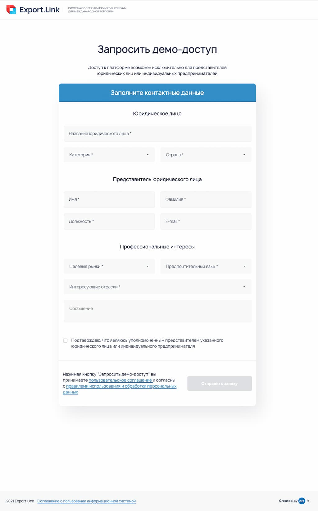

# Тестовое задание для Export Link

Форма заявки на предоставление демо-доступа

---
### Используемые технологии
 - React
 - Typescript
 - Redux, Redux Toolkit
 - Axios
 - CSS Modules, classnames
 ---
### Ссылка на опубликованную версию:
https://export-link.vercel.app/

---
### Превью:

---
### Инструкции:
1. Клонируйте репозиторий на локальную машину:
~~~
git clone git@github.com:pestrige/export_link.git
~~~
2. Перейдите в папку проекта:
~~~
cd export_link
~~~
4. Установите зависимости:
~~~
yarn install
~~~
5. Запустите проект командой:
~~~
yarn start
~~~

